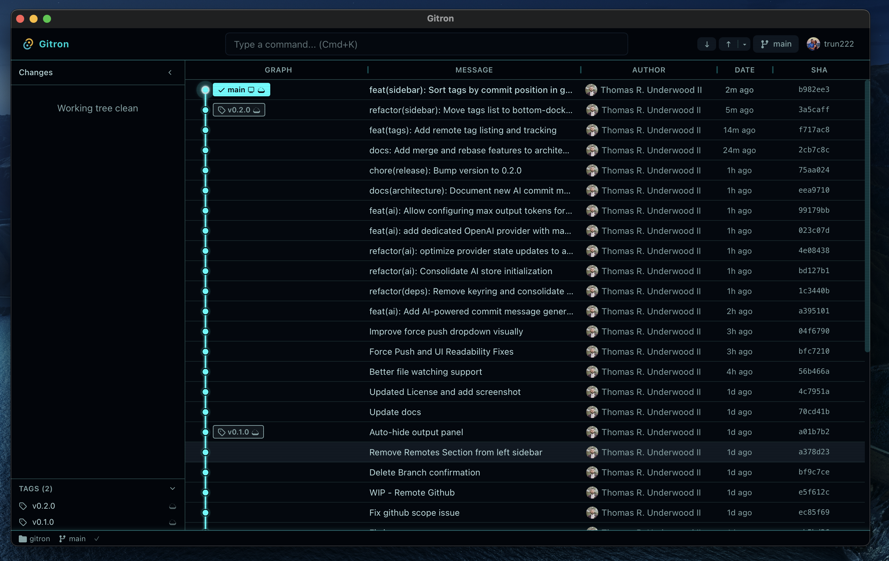

<p align="center">
  <h1 align="center">Gitron</h1>
  <p align="center">
    Open-source, AI-native Git GUI built with Rust and Svelte
  </p>
  <p align="center">
    <a href="#installation">Install</a> &middot;
    <a href="#features">Features</a> &middot;
    <a href="#server-mode">Server Mode</a> &middot;
    <a href="#development">Development</a> &middot;
    <a href="#roadmap">Roadmap</a> &middot;
    <a href="#contributing">Contributing</a>
  </p>
</p>

<p align="center">
  
</p>

---

Gitron is a fast, cross-platform Git GUI that aims to deliver the polish and depth of GitKraken — for free, as open source. Built on Rust (Tauri v2) for performance and Svelte 5 for a responsive UI, Gitron is designed from the ground up with a plugin architecture and first-class AI agent integration.

Gitron runs in two modes from the same codebase: as a **native desktop app** (Tauri v2) or as a **self-hosted web server** you can access from any browser.

> **Status:** Active development (v0.5.0). Core git operations, branching, remotes, AI features, and commit graph filtering work. Desktop and server modes available.

## Why Gitron?

The Git GUI landscape has a gap:

- **GitKraken** — polished but Electron-heavy, partially paywalled, closed-source
- **GitHub Desktop** — limited features, GitHub-centric, Electron
- **GitButler** — innovative but opinionated (virtual branches), not a traditional Git GUI
- **Lazygit** — excellent but terminal-only
- **Gittyup** — small community, limited momentum

Gitron fills the gap: a **fast, full-featured, cross-platform, open-source Git GUI** with a plugin architecture and first-class AI agent integration.

## Features

### What works today

- **Commit graph** — resizable, multi-column commit list with keyboard navigation, author filtering to hide noisy commits (e.g. bots), and collapsible committed files
- **Commit search** — search commits by message, author, or diff content from the command bar
- **Commit diff viewer** — click any commit to see its changed files in the sidebar, click a file to view its full diff with syntax highlighting and arrow key navigation
- **Staging panel** — interactive stage/unstage per file with bulk actions, flat or tree view
- **Discard changes** — discard individual files or directories via context menu
- **Gitignore management** — right-click files or extensions to add them to `.gitignore`
- **Commit authoring** — message input with Cmd/Ctrl+Enter to commit
- **AI commit messages** — generate commit titles and descriptions from staged diffs using OpenAI, Anthropic, Gemini, or OpenRouter
- **Inline diff viewer** — syntax-highlighted diffs powered by Shiki (Catppuccin Mocha theme)
- **Branch management** — create, checkout, delete, merge, and rebase branches
- **Remote operations** — fetch, pull, push, force push, delete remote branches
- **Stash management** — apply, pop, and drop stashes
- **Tag management** — create, delete, push tags; remote tag tracking; tags sorted by commit position
- **GitHub integration** — OAuth device flow login, user profile display
- **Command palette** — Cmd/Ctrl+K to search repos, branches, and actions
- **Self-hosted server mode** — run Gitron as a web server accessible from any browser, with Docker support
- **Settings persistence** — recent repositories, column widths saved between sessions, expand-tree-by-default option
- **Auto-fetch** — configurable auto-fetch intervals (15s, 30s, 1m, 5m) with silent background fetching
- **Keyboard shortcuts** — graph navigation, staging shortcuts, commit file navigation, command palette

### Planned

- Side-by-side diffs, hunk-level staging
- Merge conflict resolution editor, interactive rebase, cherry-pick
- Git blame, file history
- **Plugin system** — extend Gitron with Rust backend plugins and Svelte frontend plugins
- **Agent Gateway** — MCP server exposing repo state to AI agents with permissioned access

See the full [Roadmap](#roadmap) below.

## AI Commit Messages

Gitron can generate conventional commit messages from your staged diffs using LLM providers. Stage your files, click the sparkle button next to the commit title, and Gitron will produce a title and description.

### Setup

1. Open **Settings** (gear icon in the toolbar) and go to the **AI** tab
2. Choose a provider (OpenAI, Anthropic, Gemini, or OpenRouter)
3. Paste your API key — it's stored securely in your OS keychain (macOS Keychain, Windows Credential Manager, or Linux Secret Service)
4. Select a model from the dropdown (models are fetched live from the provider's API)
5. Click the radio button to make it your active provider

### Usage

1. Stage one or more files in the sidebar
2. Click the **sparkle button** next to the commit title input
3. Gitron reads your staged diffs, sends them to the selected AI model, and fills in both the commit title and description
4. Edit the generated message if needed, then commit

### Supported Providers

| Provider | Models | Notes |
|----------|--------|-------|
| **OpenAI** | GPT-4.1 Nano, GPT-4.1 Mini, GPT-4o Mini, and more | Models fetched dynamically; filtered to chat-capable models |
| **Anthropic** | Claude 4.5 Haiku, Claude Sonnet, etc. | Models fetched dynamically; sorted by cost tier |
| **Gemini** | Gemini 2.0 Flash Lite, Gemini 2.0 Flash, and more | Models fetched dynamically; filtered to text generation |
| **OpenRouter** | Auto (best available) + affordable models | Filtered to models under $2/M input tokens |

### Advanced Settings

Under the **Advanced** section for each provider:

- **Custom Base URL** — override the default API endpoint (useful for proxies or self-hosted models)
- **Max Output Tokens** — control how many tokens the model can use for the response (default: 1,500). Options: 500, 1,000, 1,500, 2,000, 4,000

### Privacy

- Your API keys are stored in the OS keychain, not in plain text
- Diffs are sent directly to the provider you select — Gitron does not proxy or store your code
- Only staged diffs are sent (truncated to ~8,000 characters for large changesets)

## Server Mode

Gitron can run as a self-hosted web server, giving you a full Git GUI accessible from any browser. This is useful for headless servers, remote development machines, or teams that want a shared Git interface without installing a desktop app.

### Quick Start with Docker

```bash
docker run -d \
  -p 9417:9417 \
  -v /path/to/your/repos:/repos \
  --name gitron \
  gitron-server
```

Then open `http://localhost:9417` in your browser.

### Build the Docker Image

```bash
git clone https://github.com/thomasunderwoodii/gitron.git
cd gitron
docker build -t gitron-server .
```

### Run the Server Binary Directly

If you prefer running without Docker, build and run the server binary:

```bash
# Build
cargo build -p gitron-server --release
pnpm build

# Run (serves the frontend and API on port 9417)
./target/release/gitron-server --frontend-dir build
```

### Server Options

```
gitron-server [OPTIONS]

Options:
  -p, --port <PORT>                Port to listen on [default: 9417]
      --host <HOST>                Host to bind to [default: 127.0.0.1]
      --token <TOKEN>              Authentication token (required when host != localhost)
      --frontend-dir <PATH>        Path to built frontend files
      --repo <PATH>                Auto-open a repository on startup
```

### Authentication

When binding to a non-localhost address (e.g. `--host 0.0.0.0`), the server requires a bearer token for API access. Pass it with `--token`:

```bash
gitron-server --host 0.0.0.0 --token my-secret-token
```

The frontend will prompt for the token on first load.

### Credentials and Settings

In server mode, credentials and settings are stored as JSON files in `~/.config/gitron/`:

- `credentials.json` — API keys for AI providers
- `ai_settings.json` — AI provider configuration
- `settings.json` — general settings

## Installation

### Download (coming soon)

Pre-built binaries for macOS, Windows, and Linux will be available on the [Releases](https://github.com/thomasunderwoodii/gitron/releases) page once the project reaches a stable milestone.

### Build from source

Building from source works on macOS, Windows, and Linux.

#### Prerequisites

| Tool | Version | Notes |
|------|---------|-------|
| [Rust](https://www.rust-lang.org/tools/install) | 1.75+ | Install via `rustup` |
| [Node.js](https://nodejs.org/) | 20+ | LTS recommended |
| [pnpm](https://pnpm.io/) | 9+ | Install via `npm install -g pnpm` |
| [Git](https://git-scm.com/) | 2.30+ | Required at runtime |

#### macOS

Install Xcode Command Line Tools (required for Rust compilation and system libraries):

```bash
xcode-select --install
```

Then build Gitron:

```bash
git clone https://github.com/thomasunderwoodii/gitron.git
cd gitron
pnpm install
pnpm tauri build
```

The built `.app` and `.dmg` will be in `src-tauri/target/release/bundle/`.

#### Windows

1. Install [Visual Studio C++ Build Tools](https://visualstudio.microsoft.com/visual-cpp-build-tools/) (select "Desktop development with C++")
2. WebView2 is required — it's pre-installed on Windows 10 (late builds) and Windows 11. If missing, install it from [Microsoft](https://developer.microsoft.com/en-us/microsoft-edge/webview2/)

Then build Gitron:

```powershell
git clone https://github.com/thomasunderwoodii/gitron.git
cd gitron
pnpm install
pnpm tauri build
```

The installer (`.msi` or `.exe`) will be in `src-tauri\target\release\bundle\`.

#### Linux

Install system dependencies. The exact packages depend on your distribution:

**Debian / Ubuntu:**

```bash
sudo apt update
sudo apt install libwebkit2gtk-4.1-dev build-essential curl wget file \
  libxdo-dev libssl-dev libayatana-appindicator3-dev librsvg2-dev
```

**Fedora:**

```bash
sudo dnf install webkit2gtk4.1-devel openssl-devel curl wget file \
  libxdo-devel librsvg2-devel
sudo dnf group install "C Development Tools and Libraries"
```

**Arch Linux:**

```bash
sudo pacman -S webkit2gtk-4.1 base-devel curl wget file openssl \
  xdotool librsvg
```

Then build Gitron:

```bash
git clone https://github.com/thomasunderwoodii/gitron.git
cd gitron
pnpm install
pnpm tauri build
```

The built packages (`.deb`, `.AppImage`, `.rpm`) will be in `src-tauri/target/release/bundle/`.

## Development

### Running in dev mode

**Desktop mode (Tauri):**

```bash
git clone https://github.com/thomasunderwoodii/gitron.git
cd gitron
pnpm install
pnpm dev
```

This starts the Vite dev server, compiles the Rust backend, opens the Tauri window, and watches for changes.

**Server mode (Axum):**

```bash
pnpm server:dev
```

This builds the frontend, compiles the Axum server, and serves everything at `http://localhost:9417`.

### Project structure

```
gitron/
├── crates/
│   ├── gitron-core/         # Shared Rust logic (git, AI, GitHub, cache, watcher)
│   │   └── src/
│   │       ├── git/         # All git operations (git2-rs)
│   │       ├── ai/          # AI commit message generation
│   │       ├── github/      # GitHub OAuth + API
│   │       ├── cache/       # Repo state cache
│   │       └── watcher/     # File system watcher (notify-rs)
│   └── gitron-server/       # Axum web server (thin wrapper over gitron-core)
│       └── src/
│           ├── main.rs      # CLI, server setup
│           └── routes/      # HTTP handlers (mirrors Tauri commands)
├── src-tauri/               # Tauri desktop app (thin wrapper over gitron-core)
│   └── src/
│       ├── lib.rs           # Tauri builder, command registration
│       └── commands/        # IPC handlers (no git logic)
├── src/                     # Svelte 5 frontend (shared between both modes)
│   └── lib/
│       ├── api/             # Transport abstraction (Tauri IPC or HTTP)
│       ├── stores/          # Svelte stores (state management)
│       └── components/      # UI components
├── Dockerfile               # Multi-stage build for server mode
├── docs/                    # Project documentation
└── package.json
```

### Architecture

```
┌──────────────────────────────────┐
│         Svelte 5 Frontend        │
│  (graph, diff, staging, UI)      │
└──────┬───────────────┬───────────┘
       │ Tauri IPC     │ HTTP/SSE
┌──────▼──────┐  ┌─────▼──────────┐
│  Tauri App  │  │  Axum Server   │
│  (desktop)  │  │  (self-hosted) │
└──────┬──────┘  └─────┬──────────┘
       └───────┬───────┘
┌──────────────▼───────────────────┐
│        gitron-core (shared)      │
│  ┌─────────┐  ┌──────────────┐  │
│  │ git2-rs │  │ File Watcher │  │
│  │         │  │  (notify-rs) │  │
│  └─────────┘  └──────────────┘  │
│  ┌─────────┐  ┌──────────────┐  │
│  │ git CLI │  │ Repo State   │  │
│  │         │  │ Cache        │  │
│  └─────────┘  └──────────────┘  │
└──────────────────────────────────┘
```

- **gitron-core** contains all shared logic — both the Tauri app and the Axum server are thin wrappers
- **git2-rs** handles all hot-path operations (graph traversal, diffs, status, staging, commits, branches) in-process for maximum performance
- **git CLI** is used for complex operations (rebase, advanced merge)
- **Transport abstraction** — the frontend auto-detects Tauri IPC or HTTP and uses the same API surface for both
- **Strict module boundaries** — command handlers contain zero git logic; `gitron-core` contains all git logic; frontend components never call `invoke()` or `fetch()` directly (they go through stores and API layers)

### Tech stack

| Layer | Technology | Why |
|-------|-----------|-----|
| Shared core | Rust (gitron-core) | All git, AI, and GitHub logic in one place |
| Desktop | Tauri v2 | Native performance, ~5-10MB bundle, no Electron |
| Web server | Axum | Self-hosted mode, Docker-ready, token auth |
| Git operations | git2-rs | In-process, zero-overhead git operations |
| Frontend | Svelte 5 + SvelteKit | Compiles away, minimal runtime, great DX |
| Styling | TailwindCSS v4 | Utility-first, design tokens via CSS custom properties |
| UI components | shadcn-svelte (bits-ui) | Accessible, headless primitives |
| Syntax highlighting | Shiki | Accurate, TextMate grammar-based highlighting |

### Useful commands

```bash
# Development
pnpm dev                  # Desktop mode (Tauri + Vite dev server)
pnpm server:dev           # Server mode (build frontend + Axum on :9417)
pnpm check                # TypeScript / Svelte type checking

# Production
pnpm tauri build          # Build desktop app + installer
pnpm build                # Build frontend only
pnpm build:server         # Build server binary only
```

## Roadmap

Gitron is developed in phases. Each phase builds on the previous one.

| Phase | Focus | Status |
|-------|-------|--------|
| **1. Foundation** | Core git backend, commit graph, app shell | Complete |
| **2. Core Workflow** | Stage, commit, push, pull, branch UI, diffs | Complete |
| **3. Advanced Git** | Merge, rebase, stash, tags, commit search, server mode | In progress |
| **4. Plugin System** | Backend (Rust traits) + frontend (UI slots) plugins | Planned |
| **5. Agent Gateway** | MCP server, AI agent permissions, action queue | Planned |
| **6. Polish & Release** | Theming, auto-update, code signing, installers | Planned |

See [docs/ROADMAP.md](docs/ROADMAP.md) for detailed status of every item.

## Documentation

| Document | Description |
|----------|-------------|
| [ROADMAP](docs/ROADMAP.md) | Current status and what's next |
| [ARCHITECTURE](docs/ARCHITECTURE.md) | System design, module structure, data flow |
| [TECHNICAL_SPEC](docs/TECHNICAL_SPEC.md) | IPC commands, data types, state management |
| [DEVELOPER_GUIDE](docs/DEVELOPER_GUIDE.md) | How to add features, conventions, pitfalls |
| [VISION](docs/VISION.md) | Project direction and principles |
| [PLUGIN_SYSTEM](docs/PLUGIN_SYSTEM.md) | Plugin architecture design |
| [AGENT_GATEWAY](docs/AGENT_GATEWAY.md) | AI agent gateway design |

## Contributing

Contributions are welcome! Whether it's bug reports, feature requests, documentation improvements, or code contributions — all help is appreciated.

### Getting started

1. Fork the repository
2. Create a feature branch: `git checkout -b feat/my-feature`
3. Read the [Developer Guide](docs/DEVELOPER_GUIDE.md) for conventions and module boundaries
4. Make your changes following the feature checklist: Rust types → Rust git logic → Rust command → register in lib.rs → TS types → TS API → Store → Component
5. Commit using [conventional commits](https://www.conventionalcommits.org/): `type(scope): description`
6. Open a pull request

### Commit convention

```
type(scope): description

Types: feat, fix, refactor, docs, chore, test, style
Scopes: git, ui, graph, diff, staging, branch, plugin, agent, docs
```

### Key guidelines

- Follow the strict module boundaries (see [CLAUDE.md](CLAUDE.md) or [Developer Guide](docs/DEVELOPER_GUIDE.md))
- **Dual-mode parity** — every new feature must work in both desktop (Tauri) and server (Axum) modes
- Use Svelte 5 runes (`$state`, `$derived`, `$props`) — no Svelte 4 patterns
- No `unwrap()` in Rust production code — use `GitResult<T>` and proper error handling
- Keep command handlers thin — all git logic belongs in `crates/gitron-core/`
- Use `getTransport()` for all backend calls in the frontend — never import `@tauri-apps/*` directly

## License

[PolyForm Noncommercial 1.0.0](LICENSE) — free for personal, academic, and non-commercial use. Commercial use requires a separate agreement. See the [LICENSE](LICENSE) file for full terms.
